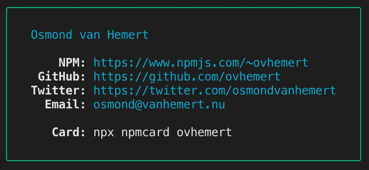

# Your NPM Business Card

[](https://travis-ci.com/ovhemert/npmcard)
[](https://david-dm.org/ovhemert/npmcard)
[](https://snyk.io/test/npm/npmcard)
[](http://standardjs.com/)

Reads public information from your NPM profile.



## Try it

``` sh
$ npx npmcard <npm username>
```

It's that easy.

## Use it

Want to create and customize your own card? Use it as a module in you project.

``` sh
$ npm install npmcard
```

And use [this](https://github.com/ovhemert/npmcard-ovhemert/blob/master/bin/index.js) as an example. More docs will come, or help me write them by sending a PR ;)

## Inspired by
[@bitandbang](https://www.npmjs.com/package/bitandbang)